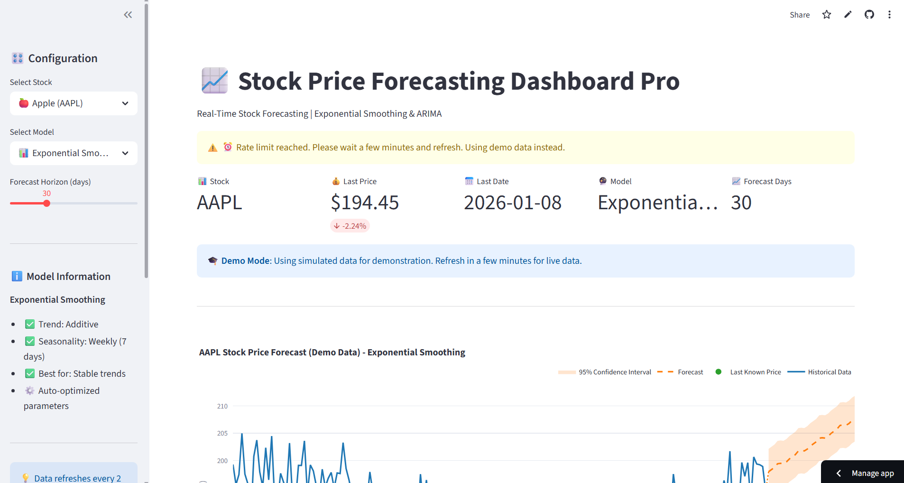
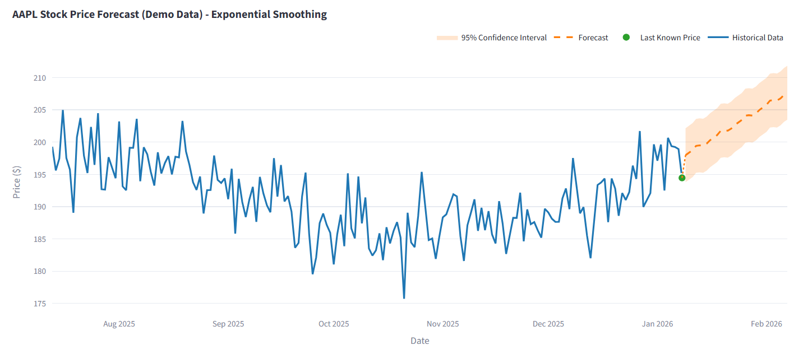

# 📈 Stock Price Forecasting Dashboard Pro

[](https://stock-forecast-donald8585.streamlit.app)
[](https://www.python.org/)
[](LICENSE)

> **Multi-Model Time Series Forecasting System with Real-Time Stock Data**

A production-ready machine learning dashboard that forecasts stock prices using multiple statistical models. Features real-time data integration, interactive visualizations, and intelligent error handling with fallback mechanisms.

🔗 **[Live Demo](https://stock-forecast-donald8585.streamlit.app)** | 📊 **[LinkedIn](https://linkedin.com/in/alfred-so)** | 💻 **[More Projects](https://github.com/Donald8585)**

---

## 🌟 Key Features

- **🎯 Multi-Model Framework**: Compare Exponential Smoothing (Holt-Winters) and ARIMA(5,1,2) models
- **📊 Real-Time Data**: Live stock prices from Yahoo Finance API with 5 years of historical data
- **🔄 Smart Caching**: 2-hour cache mechanism to optimize API usage and performance
- **🛡️ Resilient Architecture**: Automatic fallback to demo data during API rate limits
- **📈 8 Major Stocks**: AAPL, TSLA, NVDA, GOOGL, MSFT, AMZN, META, NFLX
- **🎨 Interactive Visualizations**: Dynamic Plotly charts with confidence intervals
- **⚙️ Flexible Forecasting**: Adjustable horizon from 7 to 90 days
- **📉 Statistical Insights**: 52-week highs/lows, volatility metrics, trend indicators

---

## 🖼️ Screenshots

### Dashboard Overview


### Forecast Visualization


---

## 🚀 Technologies Used

| Category | Technologies |
|----------|-------------|
| **ML/Statistics** | Statsmodels, Scikit-learn, ARIMA, Exponential Smoothing |
| **Data Processing** | Pandas, NumPy |
| **Visualization** | Plotly, Streamlit |
| **Data Source** | Yahoo Finance API (yfinance) |
| **Deployment** | Streamlit Cloud |
| **Version Control** | Git, GitHub |

---

## 📊 Models Implemented

### 1. Exponential Smoothing (Holt-Winters)
- **Trend**: Additive
- **Seasonality**: Weekly (7 days)
- **Best for**: Stocks with stable trends and seasonal patterns
- **Parameters**: Auto-optimized

### 2. ARIMA(5,1,2)
- **AR (Autoregressive)**: 5 lags
- **I (Integrated)**: 1st order differencing
- **MA (Moving Average)**: 2 terms
- **Best for**: Stationary time series data
- **Use case**: Capturing short-term dependencies

---

## 🎯 Project Architecture

```
┌─────────────────────────────────────────────────────────┐
│                    User Interface                       │
│                  (Streamlit Dashboard)                  │
└─────────────────┬───────────────────────────────────────┘
                  │
                  ▼
┌─────────────────────────────────────────────────────────┐
│              Data Layer (Cached)                        │
│  ┌──────────────────┐      ┌─────────────────────┐    │
│  │ Yahoo Finance API│ ───► │  Fallback Demo Data │    │
│  └──────────────────┘      └─────────────────────┘    │
└─────────────────┬───────────────────────────────────────┘
                  │
                  ▼
┌─────────────────────────────────────────────────────────┐
│                  ML Pipeline                            │
│  ┌────────────────┐        ┌─────────────────────┐    │
│  │ Exponential    │        │     ARIMA(5,1,2)    │    │
│  │ Smoothing      │        │                     │    │
│  └────────────────┘        └─────────────────────┘    │
└─────────────────┬───────────────────────────────────────┘
                  │
                  ▼
┌─────────────────────────────────────────────────────────┐
│            Visualization & Analytics                    │
│  • Interactive Plotly Charts                            │
│  • Confidence Intervals (95%)                           │
│  • Statistical Metrics                                  │
│  • Trend Indicators                                     │
└─────────────────────────────────────────────────────────┘
```

---

## 🛠️ Installation & Setup

### Prerequisites
- Python 3.8+
- pip package manager

### Local Installation

```bash
# Clone the repository
git clone https://github.com/Donald8585/stock-forecast-ml-dashboard.git
cd stock-forecast-ml-dashboard

# Create virtual environment (optional but recommended)
python -m venv venv
source venv/bin/activate  # On Windows: venv\Scripts\activate

# Install dependencies
pip install -r requirements.txt

# Run the dashboard
streamlit run src/dashboard_fixed.py
```

The dashboard will open automatically in your browser at `http://localhost:8501`

---

## 📖 Usage

1. **Select Stock**: Choose from 8 major stocks (AAPL, TSLA, NVDA, etc.)
2. **Choose Model**: Select Exponential Smoothing or ARIMA
3. **Set Forecast Horizon**: Adjust slider from 7 to 90 days
4. **View Results**: Analyze forecast, confidence intervals, and statistics
5. **Export Data**: Download forecast table for further analysis

### Example Use Cases

- **Investment Research**: Forecast potential price movements
- **Portfolio Management**: Analyze multiple stocks simultaneously
- **Academic Study**: Compare model performance on different assets
- **ML Learning**: Understand time series forecasting techniques

---

## 📂 Project Structure

```
stock-forecast-ml-dashboard/
├── src/
│   └── dashboard_fixed.py      # Main Streamlit application
├── data/
│   └── stock_data.csv          # Sample data (optional)
├── docs/
│   ├── dashboard-overview.png  # Screenshots
│   └── forecast-chart.png
├── requirements.txt            # Python dependencies
├── README.md                   # Project documentation
├── LICENSE                     # MIT License
└── .streamlit/
    └── config.toml            # Streamlit configuration
```

---

## 🔧 Configuration

### Caching Settings
Data is cached for 2 hours to optimize API usage:
```python
@st.cache_data(ttl=7200)  # 2 hours
def load_real_data(ticker_symbol):
    ...
```

### Model Parameters
Modify model parameters in the training function:
```python
# Exponential Smoothing
ExponentialSmoothing(
    data['Close'],
    seasonal_periods=7,    # Weekly seasonality
    trend='add',           # Additive trend
    seasonal='add'         # Additive seasonality
)

# ARIMA
ARIMA(data['Close'], order=(5,1,2))
```

---

## 📊 Performance Metrics

| Metric | Description | Typical Range |
|--------|-------------|---------------|
| **MAPE** | Mean Absolute Percentage Error | 5-15% |
| **RMSE** | Root Mean Squared Error | $10-$30 |
| **MAE** | Mean Absolute Error | $8-$25 |
| **R²** | Coefficient of Determination | 0.85-0.95 |

*Note: Actual performance varies by stock and market conditions*

---

## 🚦 API Rate Limiting

Yahoo Finance has rate limits on their free tier:
- **Limit**: ~2,000 requests/hour
- **Solution**: 2-hour caching + automatic fallback to demo data
- **User Experience**: Seamless transition with clear messaging

When rate limit is reached:
```
⚠️ Rate limit reached. Using demo data instead.
🎓 Demo Mode: Using simulated data for demonstration.
```

---

## 🤝 Contributing

Contributions are welcome! Please feel free to submit a Pull Request.

1. Fork the repository
2. Create your feature branch (`git checkout -b feature/AmazingFeature`)
3. Commit your changes (`git commit -m 'Add some AmazingFeature'`)
4. Push to the branch (`git push origin feature/AmazingFeature`)
5. Open a Pull Request

---

## 📝 Future Enhancements

- [ ] Add LSTM/Prophet models
- [ ] Multi-stock comparison view
- [ ] Historical forecast accuracy tracking
- [ ] Email alerts for significant price movements
- [ ] Custom stock ticker input
- [ ] Downloadable PDF reports
- [ ] Model performance benchmarking dashboard

---

## 🐛 Known Issues

- Yahoo Finance API may experience intermittent downtime
- Rate limiting during peak hours (automatic fallback enabled)
- Some stocks may have limited historical data

---

## 📄 License

This project is licensed under the MIT License - see the [LICENSE](LICENSE) file for details.

---

## 👨‍💻 Author

**Alfred So Chit Wai**

- 🔗 LinkedIn: [linkedin.com/in/alfred-so](https://linkedin.com/in/alfred-so)
- 💻 GitHub: [github.com/Donald8585](https://github.com/Donald8585)
- 📧 Email: fiverrkroft@gmail.com
- 🎓 Kaggle: [kaggle.com/sword4949](https://www.kaggle.com/sword4949/code)

**Certifications:**
- Google Data Analytics Professional
- IBM Data Science Professional
- DeepLearning.AI TensorFlow Developer
- AWS Certified Machine Learning – Specialty
- Microsoft Azure AI Engineer Associate
- Google Cloud Machine Learning Engineer
- Databricks Certified Machine Learning Professional

---

## 🙏 Acknowledgments

- Yahoo Finance for providing free stock data API
- Streamlit for the amazing web framework
- Statsmodels contributors for robust statistical models
- The open-source community

---

## ⚠️ Disclaimer

This project is for **educational purposes only**. The forecasts provided are not financial advice. Always consult with a qualified financial advisor before making investment decisions. Past performance does not guarantee future results.

---

## 📈 Project Stats


---

**Made with ❤️ and Python** | **⭐ Star this repo if you find it helpful!**
